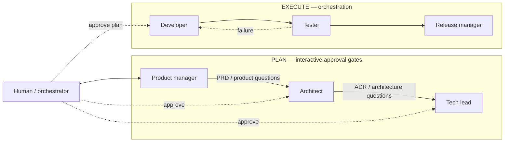

# Agentic SDLC Usage Guide

Use the toolbox as a lightweight Plan → Execute workflow. You remain the decision maker; agents
help turn your request into reviewed artifacts and then carry out the approved work.

For the detailed design, harness contract, and role semantics, see
[design.md](design.md).

## The workflow



Planning roles are interactive. They ask focused questions, produce artifacts, and ask before
moving to the next decision boundary. Execution roles work from approved artifacts and stop only for
failures or genuine blockers.

## Start with a plain-language request

Examples:

```text
The system must allow users to sign in without creating a password.
```

```text
The system must support multiple notification providers without coupling the domain to one vendor.
```

```text
Implement the Event Model slice where a user confirms a suggested category for a transaction.
```

The harness selects the first role. You do not need to translate the request into agent terminology.

## What each planning agent does

### Product manager

Use for a new or changed user capability.

Prompt shape:

```text
Turn this request into a PRD or PRD update.
Clarify users, behavior, acceptance criteria, scope, non-goals, and success measures.
Identify architecture dependencies separately; do not resolve them as product decisions.
```

Expected output:

- PRD change or new PRD.
- Product decisions and open questions.
- Architecture dependencies, if any.

Next step:

> “The product scope is clear. Shall I lock in the PRD and ask the architect to resolve the identified dependency?”

### Architect

Use when the product work or backlog exposes a cross-cutting technical choice.

Prompt shape:

```text
Using the accepted product context, create the smallest ADR needed for this decision.
Compare realistic alternatives, record the accepted boundary and consequences, and identify
the concise enforcement rules future work must follow.
```

Expected output:

- ADR with decision, rationale, alternatives, and consequences.
- Constitution or policy update when required.
- Remaining technical questions.

Next step:

> “The ADR is ready for review. Shall I lock it in and ask the tech lead to plan implementation?”

### Tech lead

Use after the PRD and required ADRs are accepted, or directly for an implementation-ready Event
Model slice.

Prompt shape for a conventional project:

```text
Plan this feature using the accepted PRD and ADRs.
Use the conventional Spec Kit path: specify → plan → tasks.
Return implementation boundaries, dependencies, and verification work.
```

Prompt shape for an Event Modeled project:

```text
Select and detail the Event Model slice for this capability.
Use em, then bridge the ratified slice into Spec Kit. Preserve commands, events, views,
invariants, scenarios, and failure paths. Do not invent new domain behavior.
```

Expected output:

- Event Model slice and bridge context, or Spec Kit specification.
- Plan and dependency-ordered tasks.
- Verification strategy and unresolved planning gaps.

Next step:

> “The plan and tasks are ready. Shall I hand them to the developer for implementation?”

## What happens after approval

Once you approve the plan, orchestration can proceed:

```text
Developer
  → implements the approved plan
  → opens a focused pull request

Tester
  → checks acceptance criteria and regressions
  → sends concrete failures back to the developer

Release manager
  → checks CI and review readiness
  → merges or reports the release blocker
```

Execution agents should not silently change product scope or architecture. If they discover a real
decision gap, they route it back to the product manager, architect, or tech lead.

## Install and refresh

```bash
./install.sh --surface codex
# or
./install.sh --surface claude

dev-toolbox update
```

This installs the role definitions as native agents and syncs the reusable skills, including the
Event Modeling skill and Event Model → Spec Kit bridge.
